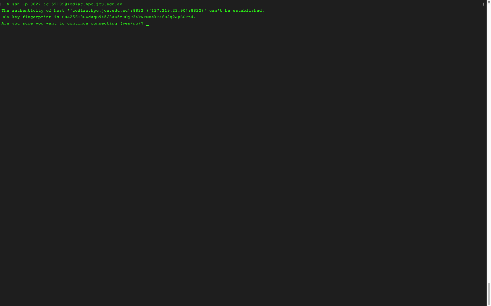

### Getting Connected

Now it's time to take our hard-won UNIX knowledge to connect to the HPC using the program `ssh`. `ssh` stands for Secure Shell.
It's a method that we can use to not only connect to, but pass commands to, our HPC as well.
A basic `ssh` commands needs only the 'address' of the remote machine we're trying to connect to, the 'port' we're connecting through and the 'user' we're connecting as.

~~~
$ ssh -p [portnumber] [user]@[remote address]
~~~
{: .bash}

In our case, the user name is your 'JC' number and the address is 'zodiac.hpc.jcu.edu.au'.
So we can connect using

~~~
$ ssh -p 8822 jcXXXXXX@zodiac.hpc.jcu.edu.au
~~~
{: .bash}

If you have never connected to the HPC before you'll now be presented with a warning.  This is your computer telling you that you're connecting to a machine that it doesn't recognise.

Your screen should look something like this:

Type yes at the prompt to proceed, this will add the HPC to the list of 'known hosts' on your computer.  This means you'll only see this warning once.  After you enter yes at the prompt you'll be prompted again for your password.

You screen should now look like this:

Notice that the characters of your password don't appear on the screen, this is normal, type carefully and press Enter when done.  

If you put your password in correctly, then you've finished connecting to HPC and your screen should now look like this:

Now you're successfully connected, but how can you prove this to yourself?  There are a few simple tricks to verify which computer you're using:

1. Observe the command prompt, yours should have changed from `~ $` to `jcXXXXXX@n029` or `jcXXXXXX@n030`.  This indicates you're signed into the HPC with this user name JCXXXXXX on Node 29 or 30
2. Enter the command `whoami`, which should report your JC number (not super helpful if you're connecting from a JCU machine, which will also return your JC number when executing `whoami`)
3. Check the directory structure using `ls`, you should notice something quite different to the file strcuture of your local machine.
4. Check your home directory with `pwd` or `echo $HOME`, either should report `/homes/XX/jcXXYYYY/`

### Staying Connected

Now that we're connected to the HPC, we can start using the programs installed on it to do operations on our data.  That's great!
There's only one problem, if we start a process running and then sever our connection to the HPC, then that process will stop.
Many things can cause a severed connection: shutting your laptop lid, typing the command `exit` into the shell, dodgy WiFi connections, etc...

How do we avoid this problem when working interactively?  We use `screen` - a program designed to allow us to keep processes running even if we lose our connection. Let's look at how this works:

We can demonstrate this problem using the `sleep` command, which just tells the shell to wait for a certain period of time before executing the next command. If we input the following command to the shell:

~~~
$ sleep 600
~~~
{: .bash}

We should see that our command prompt is gone, and won't return for 600 seconds while the computer is sleeping.  Now, close your terminal window, the re-connect w/ your `ssh` command like so:

~~~
$ ssh -p 8822 jcXXXXXX@zodiac.hpc.jcu.edu.au
~~~
{: .bash}

When you re-connected, what did you see? My guess would be that you didn't see the `sleep` command still in your prompt, when our connection was lost, the HPC 'forgot' of all the instructions we passed to it.
Here is where screen comes in, now that you're reconnected, input the following command to the shell:

~~~
$ screen
~~~
{: .bash}

Notice now, you're looking at a new blank command prompt screen.  This is your screen session.  Commands input here will keep running even if our connection is lost, to demonstrate this, input the sleep command to the shell again:

~~~
$ sleep 600
~~~
{: .bash}

To detach from this screen session, use the key binding CTRL+A then press D.  You should be brought back to the initial instance of connecting to the HPC, with a message displayed on the monitor:

~~~
[detached]
~~~
{: .bash}

If we sever our connection now, this process will keep running. To demonstrate this input the following command to the terminal:

~~~
$ screen -R
~~~
{: .bash}

We should see that our sleep command is still in the prompt.  This is a very basic example, but this could be a more complicated or time consuming process, such as an interactive R job.

We can have multiple screen sessions running simultaneously as well, to demonstrate this detach this session (Key Binding CTRL+A then D) and input another screen command to the terminal.
Now detach this session.  At this point, you should be looking at your login screen again.  Now try using reconnecting to a screen session:

~~~
$ screen -R
~~~
{: .bash}

You should now see a warning telling you that there are 'several suitable screens' which we can connect to.  We'll now need to specify the ID of the session we want to re-attach to.
We can list all the sessions we have active (on this particular node) with:

~~~
$ screen -list
~~~
{: .bash}

These are the ID's we need to connect to an individual screen session, which we can do like so:

~~~
$ screen -r [Five Digit ID].pts-33.[Node Number]
~~~
{: .bash}

Once you've re-attached to a screen session, you can finish the session by inputting the `exit` command to the Terminal.  I recommend whenever you are running interactive jobs on the HPC to use `screen`.

> ## Screen Tips
>
> Screen sessions are only listed on the Node which we are presently logged into.
> To determine which login node you've landed on
> either check your command prompt, or input the following command `echo $HOST`.
> The login nodes are 29 & 30.  To move between nodes, use `ssh`.  For example `ssh n030` would place me on Node 30.
> You can SSH into any node once you've connected, but the login nodes (29 or 30, where you land when you connect) are where you screen sessions will most likely be found.
{: .callout}

 