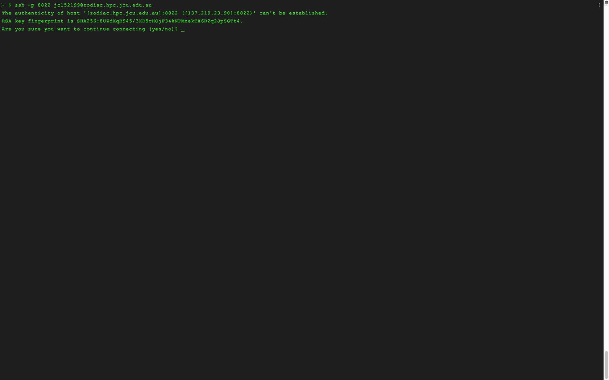
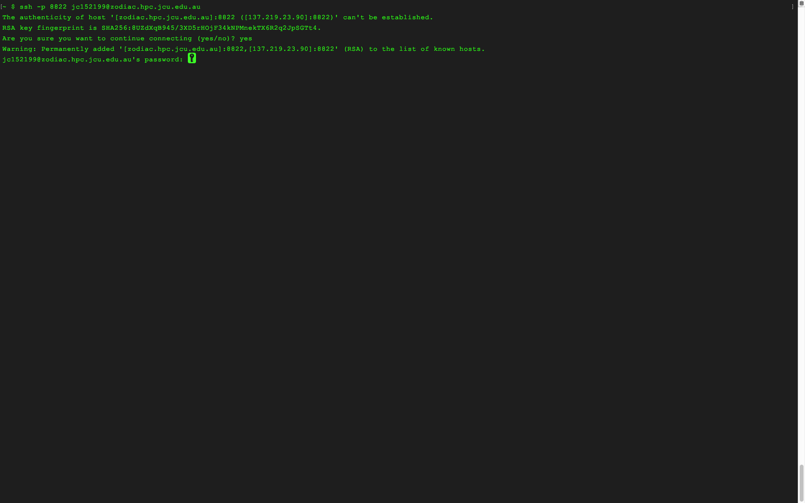
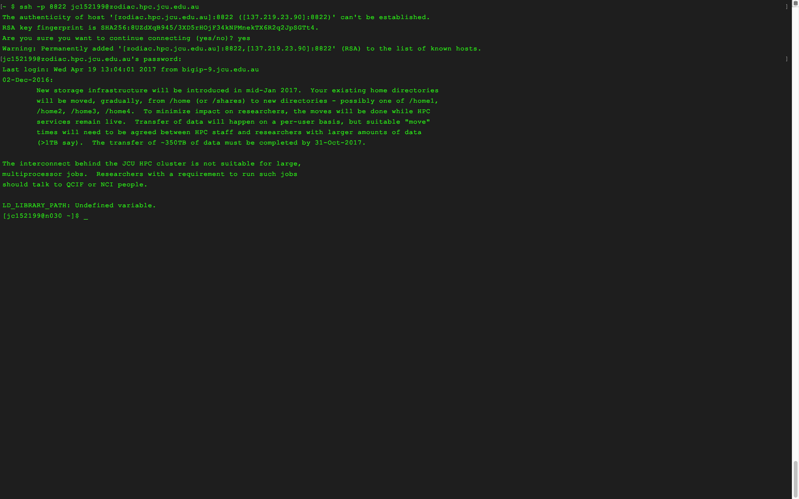

Now it's time to take our hard-won UNIX knowledge to connect to the HPC using the program `ssh`. `ssh` stands for Secure Shell.
It's a method that we can use to not only connect to, but pass commands to, our HPC as well.
A basic `ssh` commands needs only the 'address' of the remote machine we're trying to connect to, the 'port' we're connecting through and the 'user' we're connecting as.

~~~
$ ssh -p [portnumber] [user]@[remote address]
~~~
{: .bash}

In our case, the user name is your 'JC' number and the address is 'zodiac.hpc.jcu.edu.au'.
So we can connect using

~~~
$ ssh -p 8822 jcXXXXXX@zodiac.hpc.jcu.edu.au
~~~
{: .bash}

If you have never connected to the HPC before you'll now be presented with a warning.  This is your computer telling you that you're connecting to a machine that it doesn't recognise.

Your screen should look something like this:

Type yes at the prompt to proceed, this will add the HPC to the list of 'known hosts' on your computer.  This means you'll only see this warning once.  After you enter yes at the prompt you'll be prompted again for your password.

You screen should now look like this:

Notice that the characters of your password don't appear on the screen, this is normal, type carefully and press Enter when done.  

If you put your password in correctly, then you've finished connecting to HPC and your screen should now look like this:

Now you're successfully connected, but how can you prove this to yourself?  There are a few simple tricks to verify which computer you're using:

1. Observe the command prompt, yours should have changed from `~ $` to `jcXXXXXX@n029` or `jcXXXXXX@n030`.  This indicates you're signed into the HPC with this user name JCXXXXXX on Node 29 or 30
2. Enter the command `whoami`, which should report your JC number (not super helpful if you're connecting from a JCU machine, which will also return your JC number when executing `whoami`)
3. Check the directory structure using `ls`, you should notice something quite different to the file strcuture of your local machine.
4. Check your home directory with `pwd` or `echo $HOME`, either should report `/homes/15/jc152199`

 